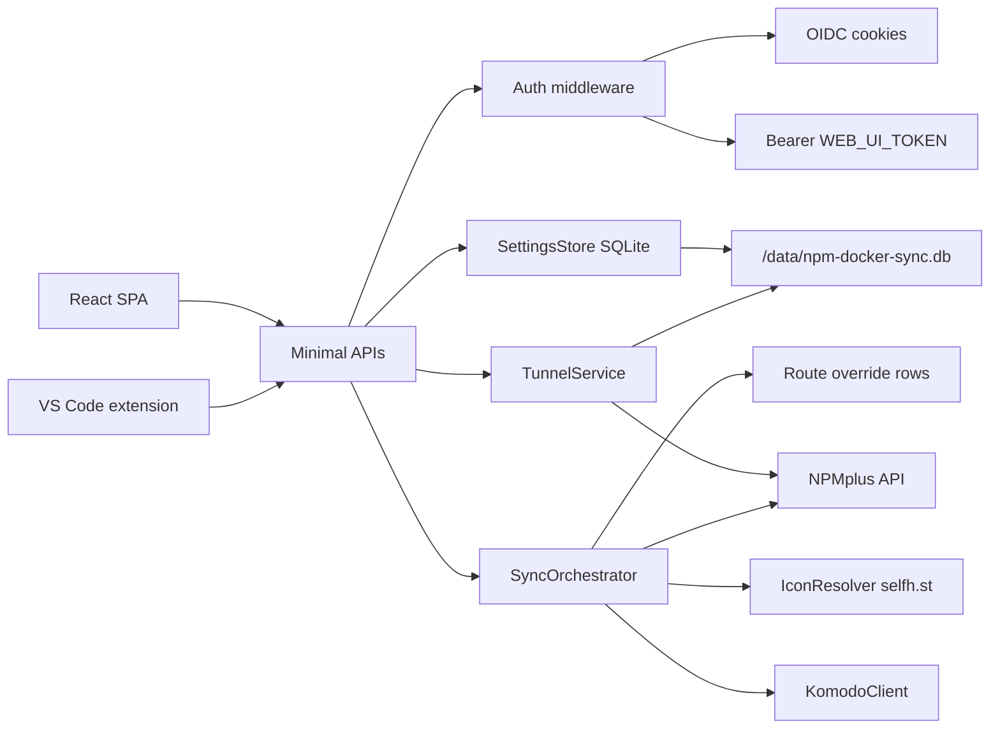

# Web UI Auth, Settings, Komodo, Route Editing, and Dev Tunnels

## Locked defaults

- **Route “OAuth”** means NPMplus **Auth Request** on the proxy host (`npmplus_auth_request` / `npmplus_auth_request_upstream`), with a **global default**, **per-route override**, and **per-route exempt** (`none`). Matches [NPMplus Authentik/oauth2-proxy integration](https://github.com/ZoeyVid/NPMplus/).
- **Settings persistence**: **SQLite** database at `/data/npm-docker-sync.db` (Docker volume). Env vars remain bootstrap defaults; DB values win once set via UI/API.
- **Manual route edits**: stored as rows in SQLite (keyed `container_id` + `proxy_index`), applied on every sync **over** labels/auto-detect; clearable from UI.
- **Settings mutations** only when auth is configured (OIDC and/or `WEB_UI_TOKEN`). Without auth, settings API returns `403`.
- **Dev tunnels (ngrok/Funnel-like UX)**: temporary **NPMplus proxy hosts** with random subdomains under a configured base domain, pointing at a **reachable** forward host (LAN / Tailscale IP / `TUNNEL_FORWARD_HOST`). Not a full outbound reverse-tunnel protocol in this pass.

## Architecture



## 1. Settings store (SQLite) + merge with config

Add [`Services/SettingsStore.cs`](Services/SettingsStore.cs) using **Microsoft.Data.Sqlite** (no EF required for a small schema):

- Path: `SQLITE_PATH` env (default `/data/npm-docker-sync.db`). Create `/data` directory on startup if missing.
- Schema (created with `CREATE TABLE IF NOT EXISTS`):
  - `app_settings` — key/value (`key TEXT PRIMARY KEY`, `value TEXT`) for global config (NPM URL/creds, proxy defaults, TLS skip verify, adopt existing, Komodo URL/server/key/secret, OIDC client settings, default `auth_request` provider/upstream, tunnel base domain / forward host / TTL defaults, etc.).
  - `route_overrides` — one row per route (`container_id TEXT`, `proxy_index INTEGER`, typed/JSON columns for port/scheme/host/TLS/auth/icon, `PRIMARY KEY (container_id, proxy_index)`).
  - `tunnels` — temporary share tunnels (see section 8).
- Writes use a short transaction + WAL mode for crash safety.
- On startup: open DB, migrate schema, expose accessors so services prefer DB over env when a key is present.
- APIs: `GET/PUT /api/settings` (auth required when any auth mode enabled); never echo secrets unless masked (`********` + `hasPassword` flags); PUT upserts keys and does not wipe unspecified secrets.

## 2. Web UI authentication (OIDC + existing token)

- Add OpenID Connect cookie auth (Authorization Code + PKCE) via ASP.NET Core auth middleware when OIDC settings present (`OIDC_AUTHORITY`, `OIDC_CLIENT_ID`, optional secret, `OIDC_SCOPES`).
- Keep `WEB_UI_TOKEN` bearer as alternate; either cookie session **or** bearer satisfies `/api/*` (except `/api/health`, OIDC callback).
- Endpoints: `GET /api/auth/status`, `GET /api/auth/login` (challenge), `GET /api/auth/logout`, `GET /api/auth/me`.
- UI: login page when unauthenticated and auth required; send cookies (`credentials: 'include'`) from [`ui/src/lib/api.ts`](ui/src/lib/api.ts).
- Tunnel APIs use the same auth (prefer long-lived `WEB_UI_TOKEN` or a dedicated `TUNNEL_API_TOKEN` stored in settings for the VS Code extension).

## 3. Route editing + enable/disable + TLS + auth_request

Extend [`RouteInfo`](Services/SyncOrchestrator.cs) with: TLS fields, `authRequest`, `authRequestUpstream`, `authExempt`, `iconOverride`, `komodo*` links, `hasUiOverride`.

New APIs (auth if configured):

| Method | Path | Purpose |
|--------|------|---------|
| `PATCH` | `/api/routes/{containerId}/{index}` | Upsert SQLite override: port, scheme, host, ssl force/http2/hsts, certificate id, websockets, auth_request, icon, etc. |
| `DELETE` | `/api/routes/{containerId}/{index}/override` | Delete override row |
| Existing | `POST .../enabled` | Keep; already sets NPM enabled + `meta.ui_disabled` |

Sync path: apply overrides after label parse; set `npmplus_auth_request` (+ upstream) from global default unless route exempt/override; keep update-in-place.

UI: route detail/edit sheet on card click.

## 4. Komodo deep links

Add [`Services/KomodoClient.cs`](Services/KomodoClient.cs) calling Komodo HTTP API ([docs](https://docs.rs/komodo_client/latest/komodo_client/api/index.html)):

- `POST {KOMODO_URL}/read/GetResourceMatchingContainer` with `X-Api-Key` / `X-Api-Secret`, body `{ "server": "<id or name>", "container": "<name or id>" }`.
- Cache ~5 minutes; enrich `RouteInfo` with Komodo deep links.
- Settings: `KOMODO_URL`, `KOMODO_SERVER`, `KOMODO_API_KEY`, `KOMODO_API_SECRET`. Disabled silently if unset.

## 5. selfh.st icons

Add [`Services/IconResolver.cs`](Services/IconResolver.cs) per [selfh.st/icons](https://selfh.st/icons-about/):

- Priority: UI override → homepage label icon → CDN guess `https://cdn.jsdelivr.net/gh/selfhst/icons/png/{slug}.png`.
- Optional HEAD probe with negative cache; UI override in edit sheet.

## 6. SPA navigation + settings page

- Routes: `/` (Apps), `/settings`, `/login`, tunnels list section or `/tunnels`.
- Settings: NPM, proxy/TLS defaults, route auth, OIDC, Komodo, **Tunnel** (`TUNNEL_BASE_DOMAIN`, `TUNNEL_FORWARD_HOST`, default TTL, token), Web UI token.
- Fix Docs link to `https://github.com/DanielC7205/npm-docker-sync`.

## 7. Docker / compose persistent storage

**[`Dockerfile`](Dockerfile)**
- `RUN mkdir -p /data`
- `ENV SQLITE_PATH=/data/npm-docker-sync.db`
- `VOLUME ["/data"]`

**[`docker-compose.test.yml`](docker-compose.test.yml)** + README examples:

```yaml
services:
  npm-docker-sync:
    volumes:
      - npm-docker-sync-data:/data
      - ${DOCKER_SOCKET:-/var/run/docker.sock}:/var/run/docker.sock
    environment:
      - SQLITE_PATH=/data/npm-docker-sync.db

volumes:
  npm-docker-sync-data:
```

## 8. Temporary share tunnels + VS Code extension

Goal: Funnel/ngrok-like **workflow** — pick a local port, get a public HTTPS URL under your NPMplus domain, share it, auto-expire — without building a full reverse-tunnel mesh.

### Prerequisite (documented clearly)

NPMplus must be able to reach the workspace host on the chosen port (same LAN, Tailscale IP, or explicit `TUNNEL_FORWARD_HOST`). This is the Tailscale Funnel model when Funnel/mesh already makes you reachable; it is **not** Cloudflare/ngrok-style outbound-only punch-through in v1.

### Backend — [`Services/TunnelService.cs`](Services/TunnelService.cs)

SQLite `tunnels` table: `id`, `slug`, `domain`, `forward_host`, `forward_port`, `forward_scheme`, `npm_host_id`, `expires_at`, `created_by`, `label`, `meta`.

APIs (auth required):

| Method | Path | Behavior |
|--------|------|----------|
| `POST` | `/api/tunnels` | Body: `{ port, scheme?, host?, ttlMinutes?, label? }`. Generate slug → `{slug}.{TUNNEL_BASE_DOMAIN}`, create NPM proxy (websockets on, SSL force + cert match if available, optional default auth_request or tunnel-exempt), insert row, return `{ url, id, expiresAt }`. |
| `GET` | `/api/tunnels` | List active tunnels |
| `DELETE` | `/api/tunnels/{id}` | Delete NPM host + row |
| `POST` | `/api/tunnels/{id}/extend` | Optional TTL bump |

Background cleanup: periodic job deletes expired tunnels from NPM + SQLite. Mark hosts with `meta.managed_by=npm-docker-sync`, `meta.tunnel=true`.

Settings keys: `TUNNEL_BASE_DOMAIN` (required to enable), `TUNNEL_FORWARD_HOST` (default reachable IP), `TUNNEL_DEFAULT_TTL_MINUTES` (e.g. 120), `TUNNEL_REQUIRE_AUTH` (apply global auth_request or not).

### VS Code extension — new folder [`vscode-extension/`](vscode-extension/)

Lightweight TypeScript extension (not published to Marketplace required for personal fork; ship as VSIX / open folder):

- Settings: `npmDockerSync.url`, `npmDockerSync.token`, optional default host override.
- Commands: **Share Port…** (input/quick-pick detected ports), **Copy Active Tunnel URL**, **Stop Tunnel**, **List Tunnels**.
- On share: `POST /api/tunnels` with chosen port; show notification with URL + Copy button; status-bar item with TTL countdown.
- On deactivate / Stop: `DELETE /api/tunnels/{id}`.
- Optional: detect `localhost` ports via VS Code `vscode.env` / simple common ports prompt (no invasive process scan required for v1).

### Web UI

- Tunnels panel: list active temporary URLs, expire time, Delete / Extend.
- Settings: tunnel base domain, forward host, TTL, whether tunnels inherit route OAuth.

## Out of scope (this pass)

- Writing Docker labels back to containers.
- Full mirror-sync UI.
- Implementing an IdP.
- **Outbound reverse-tunnel agent** (true ngrok wire protocol / relay through NAT when the workstation is unreachable from NPMplus). Can be a later phase if needed.
- Migrating from a prior JSON settings file (none shipped yet).
- Publishing the VS Code extension to the public Marketplace (VSIX + README install steps only).
